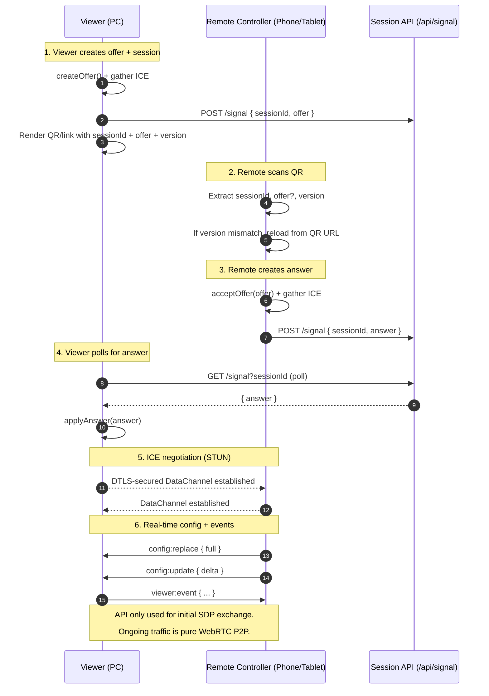

# 1. WebRTC Remote Control App

Date: 2025-11-20

## Status

Accepted

## Context

We need a way to control a large-screen "viewer" (e.g., configuration tool,
confidence monitor, signage, broadcast preview) from a handheld "remote"
(phone/tablet) without introducing a heavy backend or long‑lived server sessions.

Key constraints:

- Viewer and remote may sit on the same LAN but have no VPN/back‑channel.
- Network operators are sensitive to introducing new inbound ports or
  stateful backend services.
- UX must be approachable for non‑technical users: "scan a QR and control the
  screen".

NB. Earlier experiments relied purely on manual SDP copy/paste: the remote would
create an offer, the viewer would paste/answer, and the user would shuttle
base64 blobs between devices. This worked technically but was too fiddly for a
production‑adjacent experience.

## WebRTC Peer-to-Peer Flow

## Decision

We will:

1. Implement a browser‑only WebRTC data channel between viewer and remote.
2. Introduce a tiny "micro‑API" to smooth the initial SDP handshake.

### WebRTC roles

- **Viewer** acts as the answerer in WebRTC terms:
    - Accepts the remote's offer.
    - Produces the answer and establishes the final peer connection.
- **Remote** is the authoritative controller:
    - Creates the offer.
    - Applies the answer.
    - Streams `config:replace` and `config:update` messages over the data
    channel.

### Micro‑API for signaling

We add a minimal `/api/signal` endpoint that:

- Stores a short‑lived "session" identified by `sessionId`.
- Holds at most two fields: `offer` and `answer`.
- Is implemented as a Vercel serverless function (current demo) using:
    - Vercel KV (if configured) as a durable store.
    - An in‑memory Map with TTL as a fallback (sufficient for PoC).

The handshake is:

1. **Viewer**:
   - Generates a `sessionId`.
   - Creates a WebRTC offer and bundles ICE candidates.
   - POSTs `{ sessionId, offer }` to `/api/signal`.
   - Displays a QR code that encodes:
     - `sessionId`
     - the offer (inline, as a URL parameter)
     - a semantic app version (`v=`) for cache‑busting.

2. **Remote**:
   - Scans the QR or opens the link on mobile.
   - Extracts `sessionId`, offer, and app version.
   - If the version differs from the viewer's version, it reloads to the
     viewer's URL so both ends run the same build.
   - Uses the inline offer immediately (falling back to `GET /api/signal` if
     needed) to call `acceptOffer` and build the answer.
   - POSTs `{ sessionId, answer }` back to `/api/signal`.

3. **Viewer**:
   - Polls `GET /api/signal?sessionId=` until an answer appears.
   - Applies the answer and transitions the WebRTC session into
     `connecting/connected`.

After this, all messages travel over the WebRTC data channel with no further
API calls.

## Consequences

- The UX for non‑technical users is greatly improved:
  - They only see "Generate QR" on the viewer and "Scan" on the remote.
  - No manual copying of SDP blobs.
- The signaling API remains extremely small and easy to replace:
  - For production we can move `/api/signal` to an AWS Lambda backed by a
    managed store (DynamoDB, Redis, etc.) without changing the client
    handshake semantics.
- The viewer and remote still behave like a pure P2P WebRTC pair once the
  handshake is complete, keeping latency and operational overhead low.
- We do incur some complexity:
  - Session versioning and cache coordination (the `v=` tag and PWA SW).
  - A small amount of polling on the viewer side while waiting for the answer.

Overall, this decision strikes a balance between "no backend at all" and
practical usability, while keeping the signaling surface minimal enough to be
rewritten or replaced in a future AWS‑centric architecture.
