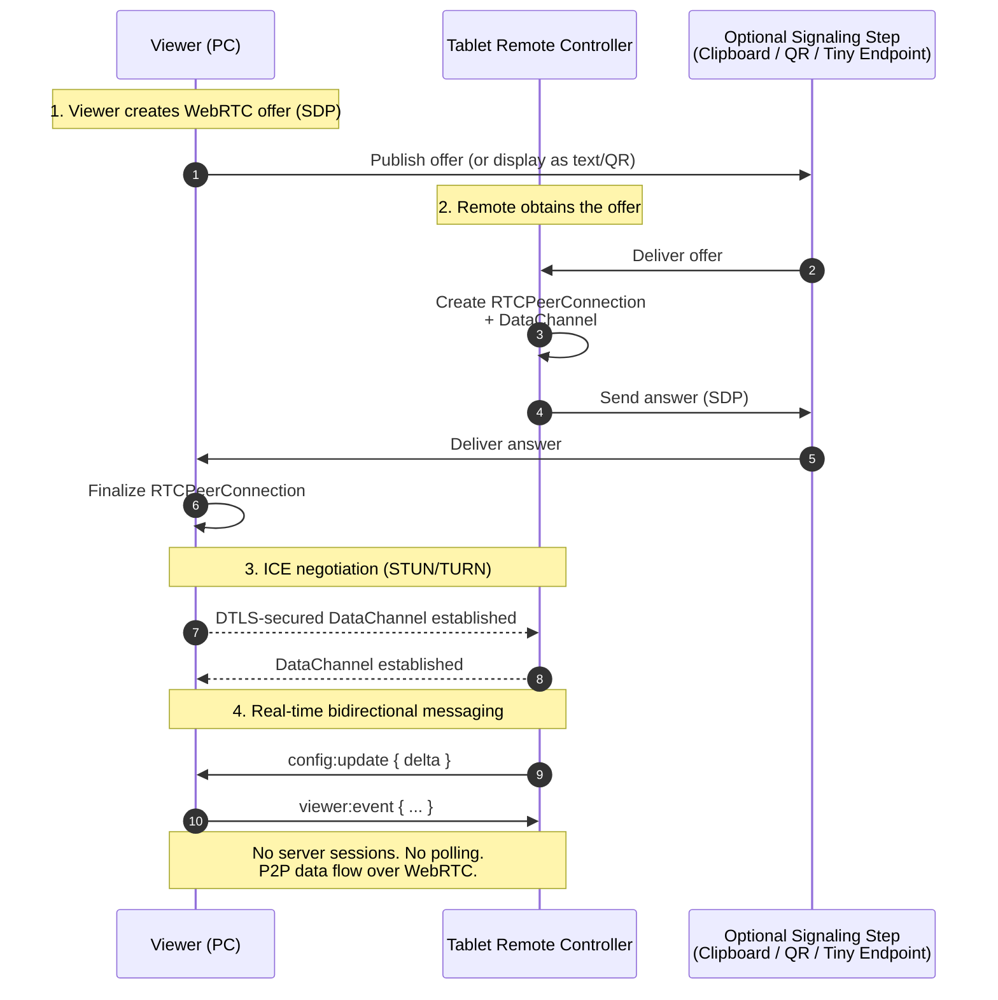

# WebRTC Diagram

```mermaid
sequenceDiagram
    autonumber
    participant Viewer as Viewer (PC)
    participant Remote as Tablet Remote Controller
    participant Signal as Optional Signaling Step<br>(Clipboard / QR / Tiny Endpoint)

    Note over Viewer: 1. Viewer creates WebRTC offer (SDP)
    Viewer->>Signal: Publish offer (or display as text/QR)

    Note over Remote: 2. Remote obtains the offer
    Signal->>Remote: Deliver offer

    Remote->>Remote: Create RTCPeerConnection<br>+ DataChannel
    Remote->>Signal: Send answer (SDP)

    Signal->>Viewer: Deliver answer
    Viewer->>Viewer: Finalize RTCPeerConnection

    Note over Viewer,Remote: 3. ICE negotiation (STUN/TURN)

    Viewer-->>Remote: DTLS-secured DataChannel established
    Remote-->>Viewer: DataChannel established

    Note over Viewer,Remote: 4. Real-time bidirectional messaging

    Remote->>Viewer: config:update { delta }
    Viewer->>Remote: viewer:event { ... }

    Note over Viewer,Remote: No server sessions. No polling.<br>P2P data flow over WebRTC.
```